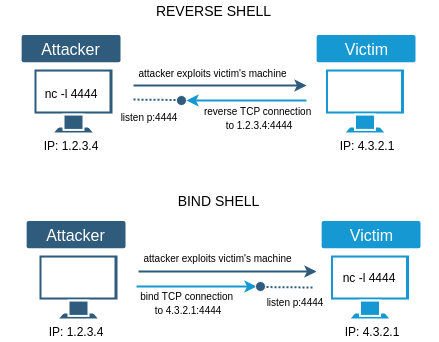

# Herramientas de Kali Linux

**Herramientas del día**
- [Ncat](#Ncat)
- [Netcat](#Netcat)
- [Shell](#Shell)
- [Wireshark](#Wireshark)
- [TCPDump](#TCPDump)
- [Burp Suite](##Burp-Suite)
- [Nessus Professional ](#Nessus-Professional)
- [Nikto](#Nikto)
- [Dirb y DirBuster](#Dirb-y-DirBuster)

## Ncat

- Es una herramienta de red que **lee y escribe** información  a través de redes desde la línea de comandos.

- Fue escrita por **Nmap Project** como una re-implementación mejorada de Netcat.

- Esta herramienta establece un **canal de comunicación** entre dos equipos de la manera mas "cruda".

**Ejemplo de uso:**
- Podemos enviar peticiones(GET, POST , ...) a sitios web.
- Abrir un Backdor en los sistemas

**Uso:**
> `ncat <IP|Domino> <PORT>`

## Netcat
- Es un homólogo de Ncat, que incluso fue **desarrollado antes** de éste.
- Posee una amplia gama de funciones al igual que ncat, sin embargo su **última publicación** estable se realizó el  2 de enero de 2007
- Los ejemplos de uso son similares a Ncat

**Uso:**
> `nc <IP|Domino> <PORT>`

**Parámetros útiles**

- **-l** : Modo escucha (listen)
- **-p** : Establecer el puerto que se necesita abrir

**Ejemplos de comandos**

Escucha por alguna conexión desde otro equipo
> `nc -l -p <PORT>`  

## Shell
- Interfaz de usuario
- Recibe comandos del teclado y se los da al sistema operativo para que realice una acción.
- El más conocido es bash.

**Mas info**
- El objetivo principal de un ataque es conseguir una **shell** de la maquina Target. Como ejemplo se puede usar fuerza bruta para conseguir acceder al ssh.

**Tipos de Shell**

*Anotación: el comando de la imagen no se encuentra completo*

- **Reverse Shell:** El atacante abre un puerto en escucha, luego explota la maquina y establece una conexión con el atacante desde la maquina victima.
- **Bind Shell:** El atacante explota la maquina y posteriormente hace que levante un puerto de escucha. Con el objetivo de conectarse al Shell de la victima 

## Mas Herramientas
### Wireshark
- Wireshark es uno de los analizadores de protocolos de red mas populares a nivel mundial.

- La función principal de Wireshark es permitir al usuario ver el tráfico que pasa a través de la red con un detalle excepcional.

### TCPDump
- TCPDump cumple la misma funcionalidad de Wireshark, pero de una forma un tanto más rústica (en terminal).

- Se utiliza a través de línea de comandos y su función es mostrar una descripción de los contenidos de los paquetes de red en una interfaz de red específica. 

### Burp Suite
- Como su nombre lo dice, es una suite de herramientas utilizadas para pruebas y auditoría de aplicaciones web.

- Posee una versión comunitaria y una profesional, ésta ultima tiene un costo de $399 al año por usuario.

### Nessus Professional
- Nessus Professional es uno de los escáner de vulnerabilidades más utilizado por la industria.

- Esta versión es pagada y está enfocada principalmente para empresas.

- Tenable posee también una versión Home que está diseñada para su uso personal o de hogar.

### Nikto
- Nikto es un escáner de vulnerabilidades Open Source escrito en el lenguaje de Perl
- Detecta malas configuraciones y vulnerabilidades servidores Web, listado de la estructura del servidor, versiones y fechas de actualizaciones de servidores.

### Dirb y DirBuster
- Sirven para evaluar aplicaciones Web.
- Dirb - Consola.
- DirBuster - GUI.
- Herramienta que realiza ataques de fuerza bruta de archivos y directorios sobre servidores web.
