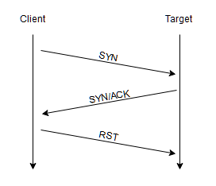

# Herramienta Nmap
> Información  obtenida de [TryHackMe - Nmap](https://tryhackme.com/room/furthernmap)

- Si no sabemos cuál de estos puertos tiene abierto un servidor, entonces no tenemos esperanza de atacar con éxito el objetivo; por lo tanto, es crucial que comencemos cualquier ataque con un escaneo de puertos

- Nmap se conectará a cada puerto del objetivo a su vez. Dependiendo de cómo responda el puerto, se puede determinar si está abierto, cerrado o filtrado (generalmente por un firewall). Una vez que sabemos qué puertos están abiertos, podemos enumerar qué servicios se están ejecutando en cada puerto, ya sea manualmente o, más comúnmente, usando nmap.   

- Es una herramienta extremadamente poderosa, que se vuelve aún más poderosa gracias a su motor de secuencias de comandos que se puede usar para buscar vulnerabilidades y, en algunos casos, incluso realizar la explotación directamente.

## Nmap Switches

> Syn Scan: `-sS`

> UDP  Scan: `-sU`

> Detect operating system `-O`

> Detect the version of the services  `-sV`

> Increase the verbosity `-v`

> Verbosity level to two `-vv`

> Save the nmap results in three major formats `-oA`

> Save the nmap results in a "normal" format `-oN`

> Save the nmap results in a "grepable" format `-oG`

> Enable "aggressive" mode `-A`

> Increase the speed your scan runs `-T5`

> Choose which port(s) to scan:

`-p 80`

`-p 1000-1500`

> Scan all ports `-p-`

> Activate a script from the nmap `--Script`

> Activate all of the scripts in the "vuln" category `--script=vuln`

## Tipos de escaneo

Algunos tipos de escaneo son los siguientes:

**Tipicos**
- TCP Connect Scans (-sT)
- SYN "Half-open" Scans (-sS)
- UDP Scans (-sU)

**Menos comunes**
- TCP Null Scans (-sN)
- TCP FIN Scans (-sF)
- TCP Xmas Scans (-sX)

### TCP connect Scans
- Un escaneo TCP funciona realizando el protocolo de *three-way handshake*  con cada puerto de destino a su vez

- Nmap intenta conectarse a cada puerto TCP especificado y determina si el servicio está abierto por la respuesta que recibe.

 Sí la solicitud se envía a un puerto abierto, el objetivo responderá con un paquete TCP con los indicadores **SYN/ACK** establecidos. Luego, Nmap marca este puerto como abierto (y completa el protocolo de enlace enviando un paquete TCP con **ACK** configurado).

Sí Nmap envía una solicitud TCP con el indicador **SYN** establecido en un puerto cerrado, el servidor de destino responderá con un paquete TCP con el indicador **RST** (Reinicio) establecido. Mediante esta respuesta, Nmap puede establecer que el puerto está cerrado.

### SYN Scans
Los escaneos **TCP** realizan un protocolo de enlace completo de tres vías con el objetivo, los escaneos **SYN** devuelven un paquete RST TCP después de recibir un SYN/ACK del servidor (esto evita que el servidor intente realizar la solicitud repetidamente)

Este tipo de respuestas es ventajoso para nosotros como hackers.

- Se puede usar para **eludir** los sistemas de detección de intrusos más antiguos, ya que buscan un apretón de manos completo de tres vías.
- Las aplicaciones que escuchan en puertos abiertos a menudo **no registran los escaneos SYN**, ya que la práctica estándar es registrar una conexión una vez que se ha establecido por completo.
- Los escaneos SYN son significativamente **más rápidos** que un escaneo TCP Connect estándar

Algunas desventajas son:
- Requieren permisos sudo. Esto se debe a que los escaneos SYN requieren la capacidad de crear "raw packets".
- Los escaneos SYN a veces derriban los servicios inestables.

### UDP Scans
Las conexiones UDP se basan en el envío de paquetes a un puerto de destino y, en esencia, esperan que lo logren. Esto hace que UDP sea excelente para conexiones que dependen de la velocidad sobre la calidad.

Pero la falta de reconocimiento hace que UDP sea significativamente **más difícil** (y mucho más lento) de **escanear**

Cuando se envía un paquete a un **puerto UDP abierto**, no debería haber respuesta. Cuando esto sucede, Nmap se refiere al puerto como `abierto|filtrado`, sospecha que el puerto está abierto, pero podría estar bloqueado por el firewall.

Cuando se envía un paquete a un **puerto UDP cerrado**, el objetivo debe responder con un paquete **ICMP** (ping) que contiene un mensaje que indica que el puerto no está disponible.

**Recomendaciones**

Por lo general, es una buena práctica ejecutar un escaneo Nmap con `--top-ports <número>` habilitado.

Escanear los 20 puertos UDP más utilizados

> `nmap -sU --top-ports 20 <HOST>`

### NULL, FIN & Xmas Scans

- Tienden a ser aún más sigilosos, en términos relativos, que un escaneo "sigiloso" SYN.
- Envían paquetes mal formados.
- La respuesta esperada para los puertos abiertos con estos escaneos es muy similar a la de un escaneo UDP.

**NULL**
Los escaneos NULL son cuando la solicitud TCP se envía sin ningún indicador (Flag) establecido. Según el RFC, el host de destino debe responder con un RST si el puerto está cerrado.

**FIN**
Trabaja de manera casi idéntica que el escaneo NULL; pero en lugar de enviar un paquete completamente vacío, se envía una solicitud con la bandera `FIN` (generalmente se usa para cerrar con gracia una conexión activa)

**Xmas**
Los escaneos de Xmas envían un paquete TCP con formato incorrecto y esperan una respuesta RST para puertos cerrados. las flags que establece son `PSH`, `URG` y `FIN`

**Mas detalles**
- Si un puerto se identifica como filtrado con uno de estos escaneos, generalmente se debe a que el destino ha respondido con un paquete `ICMP` inalcanzable.
- Muchos cortafuegos están configurados para enviar paquetes TCP entrantes a puertos bloqueados que tienen el indicador SYN.
- En particular, se sabe que Microsoft Windows (y muchos dispositivos de red de Cisco) responden con un RST a cualquier paquete TCP con formato incorrecto, independientemente de si el puerto está realmente abierto o no.

### Network Scanning
Nmap envía un paquete ICMP a cada dirección IP posible para la red especificada. Cuando recibe una respuesta, marca la dirección IP que respondió como viva.Esto no siempre es exacto; sin embargo, puede proporcionar una línea de base y, por lo tanto, vale la pena cubrirlo.

Para realizar un "ping sweep" (Con notación CIDR)

> `nmap -sn 192.168.0.1-254`

> `nmap -sn 192.168.0.0/24`

> El interruptor `-sn` le dice a Nmap que no escanee ningún puerto. obligándolo a depender principalmente de paquetes de ICMP o ARP

## NSE Scripts
Los scripts NSE(Nmap Scripting Engine) están escritos en el lenguaje de programación Lua y se pueden usar para hacer una variedad de cosas: desde buscar vulnerabilidades hasta automatizar exploits para ellas.

Nmap almacena sus scripts en Linux en `/usr/share/nmap/scripts`

Nmap utiliza este archivo para realizar un seguimiento de (y utilizar) secuencias de comandos para el motor de secuencias de comandos, `/usr/share/nmap/scripts/script.db`.

Algunas categorías útiles son:
- `safe`: No afectará al objetivo
- `intrusive`: Es probable que afecte al objetivo
- `vuln`: Explorar en busca de vulnerabilidades
- `exploit`: Intenta explotar una vulnerabilidad
- `auth`: Intentar omitir la autenticación para ejecutar servicios
- `brute`: Intento de credenciales de fuerza bruta para ejecutar servicios
- `discovery`: Intenta consultar los servicios en ejecución para obtener más información sobre la red

> **mas**: https://nmap.org/book/nse-usage.html

**Comandos útiles**

Para ejecutar un script específico
> `--script=<script-name>`

Para ejecutar varios scripts en específico
> `--script=<script-name>,<script-name>,<script-name>` 

Existen Scripts que requieren parámetros (http-put requiere URL y ubicación del archivo)
> `nmap -p 80 --script http-put --script-args http-put.url='/dav/shell.php',http-put.file='./shell.php'` 

ver Help de cada script
> `nmap --script-help <script-name>`

le dice a Nmap que no se moleste en hacer ping al host antes de escanearlo
> `-Pn`

Fragmentar los paquetes, lo que hace menos probable que los paquetes sean detectados por un firewall o IDS.

> `-f`

Proporcionando más control sobre el tamaño de los paquetes, Debe ser múltiplo de 8

> `--mtu <number>`

Evadir cualquier disparador de firewall/IDS basado en el tiempo o para cuando la red es inestable

> `--scan-delay <time>ms`

Genera un "checksum" no válido para paquetes, Se puede utilizar para determinar la presencia de un cortafuegos/IDS. Debido a que estos no toman en cuenta el "checksum"

> `--badsum`
