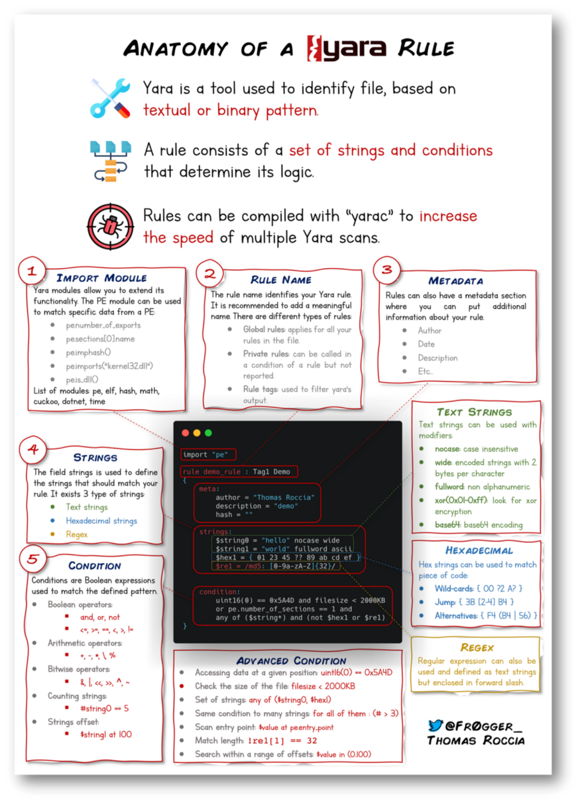

# YARA (Yet Another Ridiculous Acronym)
Yara puede identificar información basada en patrones binarios y textuales, como hexadecimales y cadenas contenidas en un archivo.


## Usar Yara Introducción
Usar una regla de Yara es simple. Cada comando yara requiere dos argumentos para ser válido, estos son
- El archivo de reglas que creamos 
- Nombre del archivo, directorio o ID de proceso para el que se usará la regla.

Ejemplo de Regla
```
rule examplerule {
        condition: true
}
```

Ejecutar comando Yara
> `yara myrule.yar somedirectory`

## Reglas

> **Documentacion:** https://yara.readthedocs.io/en/stable/writingrules.html

**Meta**
- Reservado para información descriptiva por el autor de la regla
- Se puede visualizar información con `desc`

**String**
- Para definir la palabra clave, es decir la cadena que queremos buscar.
- Un ejemplo de ello seria `$hello_world = "Hello World!"`
- En caso de tener mas de uno declarado se puede evaluar todos con la condición `any of them`

**Conditions**
- Se puede utilizar operadores como `<=`, `>=`, `!=`, `any of them`, etc.
- En caso de usar la siguiente condición `$hello_world <= 10`, la condición sera cierta si el string aparece 10 veces o menos.

**Combining keywords**
- Se pueden utilizar palabras clave como `and`, `not` u `or`; Para combinar diferentes condiciones.

### Mas sobre las reglas en yara


> [Mas infografías del mismo autor](https://blog.securitybreak.io/security-infographics-9c4d3bd891ef)

## Integración con otras librerías
- **Cuckoo:** Cuckoo Sandbox es un entorno de análisis de malware automatizado. Este módulo le permite generar reglas de Yara basadas en los comportamientos descubiertos en Cuckoo Sandbox.
- **Python PE:** El módulo PE de Python le permite crear reglas de Yara a partir de varias secciones y elementos de la estructura de Windows Portable Executable (PE).

## Otras herramientas relacionadas con Yara
> [Repositorio con increíbles reglas de YARA](https://github.com/InQuest/awesome-yara)

**LOKI**
- LOKI es un escáner IOC (Indicator of Compromise) gratuito de código abierto creado/escrito por Florian Roth
- [Repositorio](https://github.com/Neo23x0/Loki)

**THOR**
- THOR Lite es un escáner IOC Y YARA multiplataforma, y es la segunda creación de Florian
- Una buena característica con THOR Lite es su aceleración de escaneo para limitar los recursos de CPU agotados
- [Mas información](https://www.nextron-systems.com/thor-lite/)

**FENRIR**
- Elaborado también por Florian Roth (Neo23x0)
- La versión actualizada se creó para abordar el problema de sus predecesores, donde se deben cumplir los requisitos para que funcionen. Fenrir es un script bash.

**YAYA**
- YAYA es una nueva herramienta de código abierto para ayudar a los investigadores a administrar múltiples repositorios de reglas YARA
- YAYA solo se ejecutará en sistemas Linux.

## LOKI comandos

Ver Ayuda de Loki
> `python loki.py -h`

Agregar el directorio base de firmas (obligatorio si es primera vez usándolo en el sistema)
> `python loki.py --update`

Analizar los archivos contenidos en el PATH.
> `python ~/Loki/loki.py -p <PATH>`

Usando [YarGen](https://github.com/Neo23x0/yarGen) para crear reglas personalizadas de archivos sospechosos
> `python3 yarGen.py`

Generar Regla 
> `python3 yarGen.py -m ~/suspicious-files/file2 --excludegood -o ~/suspicious-files/file2.yar`

Copiar nueva regla a las reglas del LOKI
> `cp file2.yar ~/tools/Loki/signature-base/yara`

## Valhalla
> https://www.nextron-systems.com/valhalla/

- VALHALLA aumenta las capacidades de detección con el poder de miles de reglas YARA de alta calidad hechas a mano.
- Se pueden realizar búsquedas basadas en una palabra clave, etiqueta, técnica ATT&CK, sha256 o nombre de regla.
